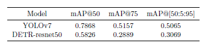

# HW 1

## Environment

```shell
# If you have conda, we recommend you to build a conda environment called "cvpdl-hw1"
make
conda activate cvpdl-hw1
pip install -r requirements.txt
git clone https://github.com/SkalskiP/yolov7.git
```

## Yolov7

### Train

```shell
bash yolo_train.sh
```
### Test

```shell
bash yolo_test.sh
```

## DETR-resnet50

### Train

```shell
bash detr_train.sh
```
### Test

```shell
bash detr_test.sh
```

## Reproduce my result

```shell
bash hw1_download.sh
bash hw1.sh
```

## Result

<div align="center">
    <a href="./">
        
    </a>
</div>
