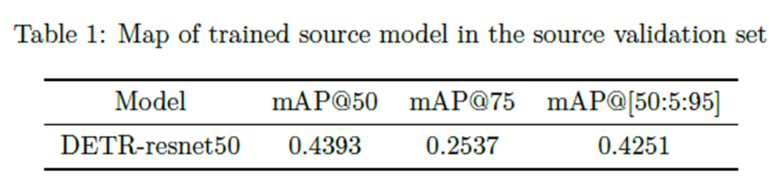
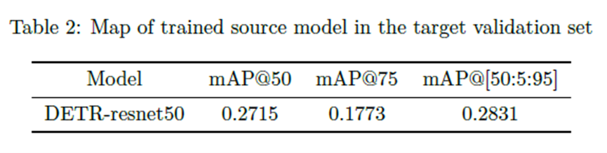
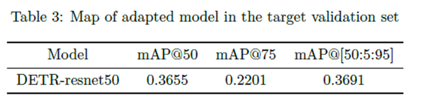

# HW 3

## Intro
請詳閱 [hw3_Intro](./hw3_Intro.pdf)

## Environment

### MSVC

```shell
需要安裝MSVC，我是透過安裝visual studio 2019才安裝成功。
下載:Visual Studio Community 2019 (version 16.11)
https://my.visualstudio.com/Downloads?q=visual%20studio%202019&wt.mc_id=o~msft~vscom~older-downloads
選擇C++桌面開發及python開發進行安裝。
需要加入path至environment variable
EX:C:\Program Files (x86)\Microsoft Visual Studio\2019\Community\VC\Tools\MSVC\14.29.30133\bin\Hostx86\x64
```

### Install

```shell
# If you have conda, we recommend you to build a conda environment called "cvpdl-hw3"
# CUDA version==11.7
make
conda activate cvpdl-hw3
pip install -r requirements.txt
#install mmcv
git clone https://github.com/open-mmlab/mmcv 
cd mmcv
pip install -r requirements.txt
python setup.py build_ext
python setup.py develop
cd ..
cd O2net/models/ops
sh ./make.sh
```

## O2net

### Train

```shell
bash hw3_train.sh "O2net/data/train_dir/" "O2net/data/val_dir/" "best_model.pth" "best_fog_model.pth" 
```
### Test

```shell
bash hw3_inference.sh "./input/test_dir/" "./output/pred.json" 3
```

## Result

<div align="center">
    <a href="./">
        
        
        
    </a>
</div>

## Reference

- [O2net](https://github.com/BIT-DA/O2net)
- [YOLOv7](https://github.com/WongKinYiu/yolov7)